# Production Incident Report

## Incident: Complete Production Outage — Database Connection Exhaustion & CPU Saturation

| Field | Detail |
|---|---|
| **Incident ID** | INC-001 |
| **Date** | February 12, 2026 |
| **Duration** | ~1 hour 30 minutes (1:00 PM IST — 2:30 PM IST) |
| **Severity** | P0 — Complete production outage |
| **Affected Services** | shelfscan-prod-v1, Metabase dashboards |
| **Affected Clients** | All — field surveyors unable to upload data, HQ dashboards inaccessible |
| **Database Instance** | gcp-db-1 (Cloud SQL PostgreSQL 17.7, us-central1-f, 20 vCPUs, 52 GB RAM, 191 GB SSD) |
| **On-Call / First Responder** | Backend Engineering Team |
| **Report Author** | Ashok |
| **Report Date** | February 15, 2026 |

---

## 1. Executive Summary

On February 12, 2026, our production platform experienced a complete outage lasting approximately 1 hour 30 minutes during peak operational hours (1:00 PM — 2:30 PM IST). All client-facing services — including the surveyor mobile app, portal dashboards, and internal Metabase analytics — became completely unresponsive.

The root cause was a **multi-factor system collapse** involving table bloat from a long-running replication transaction, connection pool exhaustion, CPU saturation, and architectural issues with multiple databases sharing a single Cloud SQL instance. The immediate fix was stopping an experimental read replica, but the underlying issues require broader infrastructure changes to prevent recurrence.

This was not a sudden failure. The system had been degrading over multiple days, and the team had already performed one emergency CPU upgrade (12 → 16 cores) in the days prior. The outage on February 12 was the point at which the system could no longer absorb the growing pressure.

---

## 2. Background: Pre-Existing CPU Escalation

Before detailing the outage itself, it is important to understand the pattern of escalation that led to it.

### The CPU Scaling History

Over the weeks preceding the outage, the production Cloud SQL instance `gcp-db-1` experienced progressively increasing CPU utilization due to growing traffic and data volume across all ShelfExecution products.

**First escalation (days before the outage):**
CPU utilization on the then-12-vCPU instance began hitting critical levels. The team upgraded the instance from **12 vCPUs to 16 vCPUs**. This upgrade was performed at night during low-traffic hours, so no user-facing outage occurred. The system stabilized temporarily.

**Read replica created (~February 10):**
An experimental read replica was created on the same Cloud SQL instance for internal testing and evaluation purposes. This replica established a WAL (Write-Ahead Log) sender process on the primary database that maintained a persistent, long-running connection.

**February 12, morning (day of the outage):**
CPU utilization on the 16-vCPU instance had climbed back to critical levels. The Cloud SQL dashboard showed:

- CPU utilization (P99): **93.867%**
- CPU utilization (P50): **14.375%** (median was okay, but spikes were extreme)
- Disk utilization: **40.642%**
- Peak connections: **108** (within normal range at this point)

> **Figure 1:** Cloud SQL Dashboard — Feb 12 morning, showing 93.867% CPU P99, 40.642% disk utilization, 108 peak connections on the 20 vCPU instance
>
> 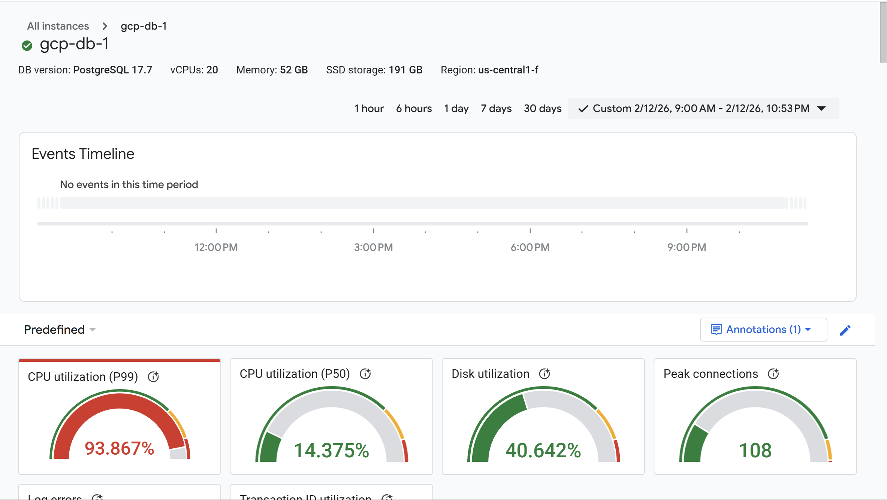

The team decided to upgrade from **16 vCPUs to 20 vCPUs** to address the CPU pressure. Unlike the previous upgrade, this was performed during daytime business hours.

**The pattern:** Each CPU upgrade was treating a symptom — high CPU — without addressing the underlying causes: table bloat from the replica, heavy analytical queries from Metabase on the primary, multiple databases sharing resources, and no query timeouts or resource guardrails. Each upgrade bought temporary relief, but the root causes continued to worsen.

---

## 3. Timeline of Events — February 12, 2026

### Phase 1: System Under Pressure (Morning)

**9:00 AM — 12:00 PM IST:**
The system was operational but under significant strain. Cloud SQL monitoring showed:

- Query latency (P99) was spiking to **30–40 seconds** periodically throughout the morning
- CPU utilization was sustained at high levels and climbing
- Database load was elevated, primarily from `shelfscan-prod-v1`

> **Figure 2 + 3 + 11:** Query Latency (P99 spikes to 30-40s), CPU Utilization (sustained high), Database Load by DB, and Log Entries by Severity — all from the same dashboard view
>
> 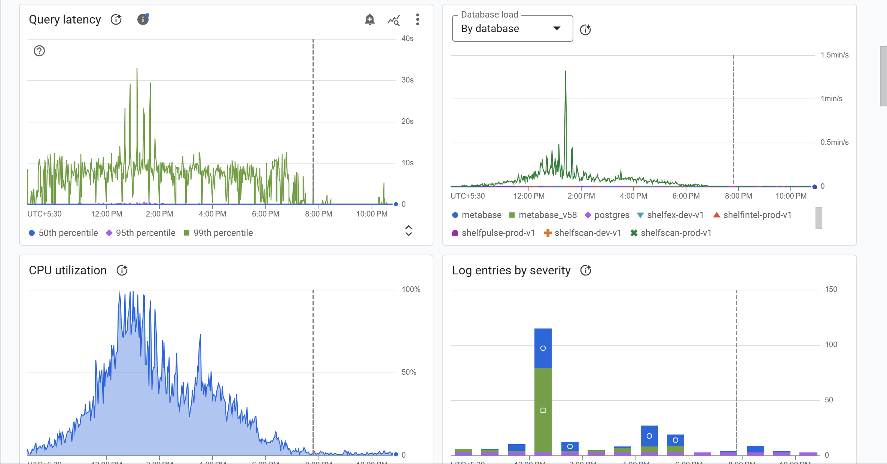

The "Oldest Transaction by Age" metric began climbing, eventually reaching approximately **25,000 seconds (~7 hours)**. This indicated that a transaction had been held open since early morning — later identified as being associated with the read replica's WAL sender process.

> **Figure 4 + 6:** Oldest Transaction by Age (~25,000s spike) and Rows Fetched vs Returned vs Written (500M/s spike), plus WAL Archiving and Transaction ID utilization
>
> 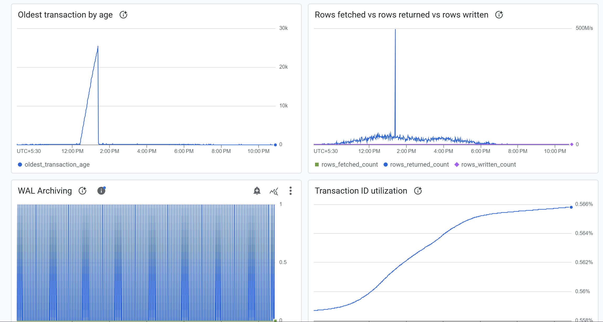

Block read counts spiked to **6 million reads/second**, indicating that queries were scanning enormous volumes of data — far more than expected for normal operations. This was a direct consequence of table bloat from dead rows that autovacuum could not clean up.

> **Figure 5 + 10:** Block Read Count (spike to 6M/s), Deadlock Count (zero), Rows Processed by operation, and Rows in DB by state
>
> 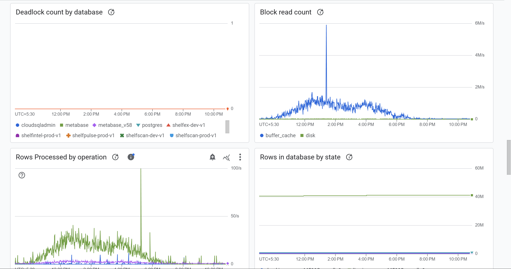

Rows fetched spiked to approximately **500 million rows/second** — orders of magnitude higher than normal, confirming that queries were scanning through massive amounts of dead (bloated) row data.

> **Figure 6:** Rows Fetched vs Returned vs Written — see composite image in Figure 4+6 above

### Phase 2: Outage Begins (~1:00 PM IST)

**~1:00 PM IST:**
The system reached its breaking point. The backend services started receiving connection timeout errors from the PostgreSQL connection pool:

```
Error: timeout exceeded when trying to connect
    at /app/node_modules/pg-pool/index.js:45:11
```

Within a 30-second window (1:24:00 PM — 1:24:30 PM IST), GCP logging recorded **522 log entries**: 320 Default, 69 Info, 58 Warnings, and **75 Errors**.

> **Figure 7:** GCP Log Summary — 522 entries in 30 seconds (320 Default, 69 Info, 58 Warning, 75 Error)
>
> 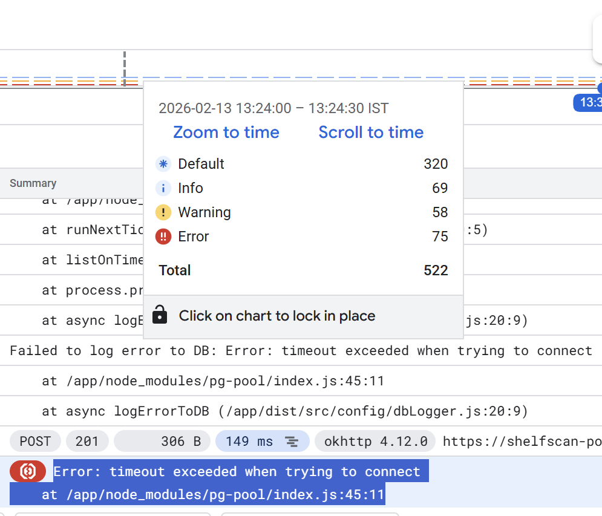

The error logger (`dbLogger.js`) attempted to write these errors to the production database, which itself was failing — creating a feedback loop:

```
Failed to log error to DB: Error: timeout exceeded when trying to connect
    at /app/dist/src/config/dbLogger.js:20:9
```

The shelfscan-portal-backend on Cloud Run began returning **HTTP 400 errors** to all incoming requests. The mobile surveyor app (okhttp 4.12.0 client) received rapid-fire failures with response times of only 11–28ms — the backend was failing fast without even reaching the database.

> **Figure 8:** Backend HTTP logs — wall of GET 400 responses, all within the same second, 348 bytes each, from okhttp 4.12.0 client
>
> 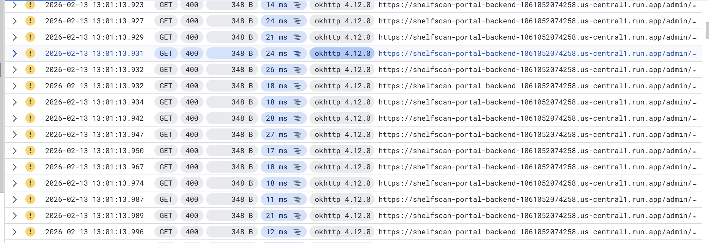

**Cloud SQL Dashboard at peak of outage:**

- CPU utilization (P99): **89.483%**
- Peak connections: **606** (exceeded the 600 max connection limit)
- Log errors: **486**
- Transaction ID utilization: **0.571%** (not a concern)
- Deadlock count: **0** (confirmed this was not a locking issue)

> **Figure 9:** Cloud SQL Dashboard gauges — CPU 89.483%, Peak connections 606 (red), 486 log errors, 0 deadlocks
>
> 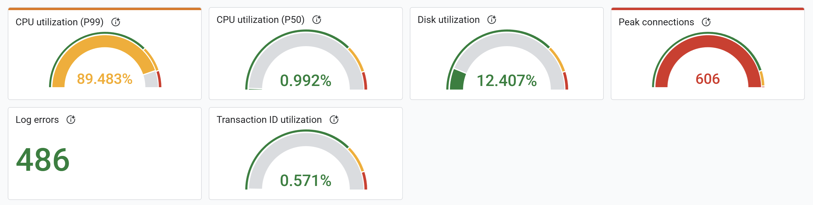

> **Figure 10:** Deadlock Count by Database — flat zero across the entire day, confirming no deadlocks
>
> 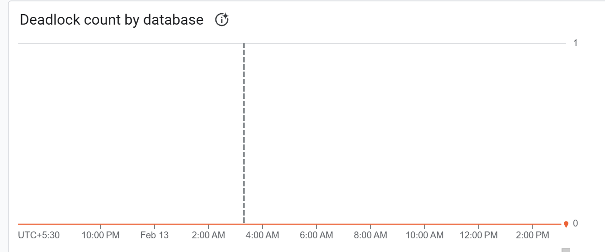

The database load chart showed a massive spike around 1:00 PM IST, dominated by `shelfscan-prod-v1`. The log entries by severity showed a burst of errors concentrated in the same window.

> **Figure 11:** Database Load by Database + Log Entries by Severity — see composite image in Figure 2+3+11 above

The connections per database chart revealed that the single Cloud SQL instance was serving **8+ databases** simultaneously, with `shelfscan-prod-v1` consuming the majority of connections (40–50+), alongside `metabase`, `metabase_v58`, `shelfex-dev-v1`, `shelfintel-prod-v1`, `shelfpulse-prod-v1`, `shelfscan-dev-v1`, and `cloudsqladmin`.

> **Figure 12 + 13:** Connections per Database (8+ DBs, shelfscan-prod-v1 dominating at 40-50+), Wait Event Types (spike to 30+), IO Wait Breakdown (15-20ms/s), and Data Transfer bytes
>
> 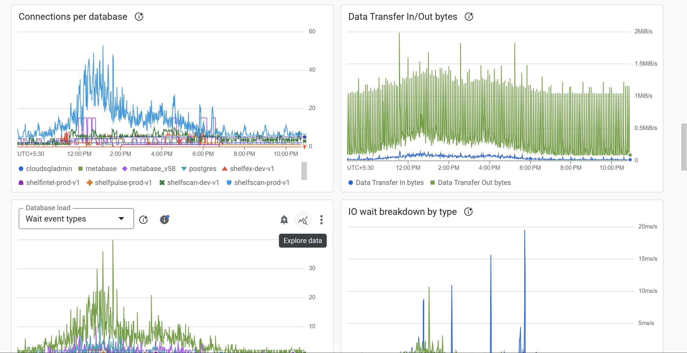

Wait events spiked to **30+** during the outage window, and IO wait reached **15–20ms/s**, confirming the disk was being hammered by temp file operations.

> **Figure 13:** Wait Events + IO Wait — see composite image in Figure 12+13 above

Temp data size reached **20+ GB** across **2,500+ temporary files**, generated primarily by the visits SELECT query and other operations spilling to disk due to insufficient `work_mem`.

> **Figure 14 + 15:** Temp Data Size (20+ GB from shelfscan-prod-v1) and Temp Files count (peak ~2,500–3,000)
>
> 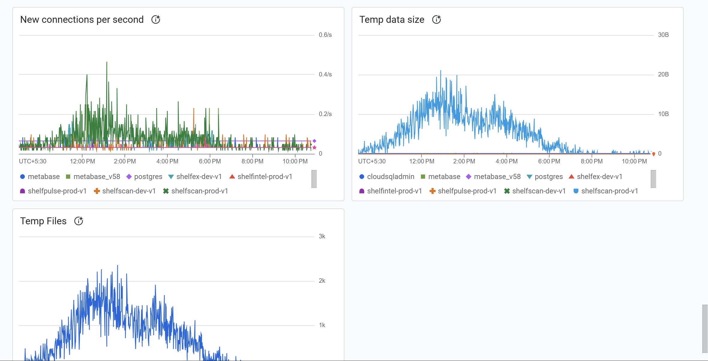

### Phase 3: Response Actions (1:00 PM — 1:20 PM IST)

**~1:05 PM IST — Action 1: Backend Rollback (DID NOT FIX)**

The team's first hypothesis was that a recent backend deployment had introduced a bug causing excessive connections. We rolled back 100% of traffic to the previous known-stable backend version on Cloud Run.

**Result:** The same connection timeout errors continued. This confirmed the problem was not in the application code but at the database level.

**~1:10 PM IST — Action 2: Database Restart (DID NOT FIX, CAUSED SECONDARY IMPACT)**

Given that the backend rollback didn't help and CPU was at 100%, the team restarted the database (this coincided with the CPU upgrade from 16 → 20 vCPUs, as Cloud SQL requires a restart for machine type changes).

Cloud SQL performed a **fast shutdown**, which triggered a severe secondary cascade:

**Step 1 — Shutdown initiated:**
```
LOG: received fast shutdown request
LOG: aborting any active transactions
```

**Step 2 — All connections forcibly terminated:**
```
FATAL: terminating connection due to administrator command
```

**Step 3 — All in-flight queries cancelled**, including active visits queries from the backend:
```
LOG: postgres process with PID 1750476 for the query 
"select "visits"."id", "visits"."visit_id", "visits"."visit_name", 
"visits"."survey_id", "visits"."admin_id", "visits"."surveyor" 
has been cancelled.
```

**Step 4 — Cancelled queries dumped intermediate results to temporary files:**
```
LOG: temporary file: path "base/pgsql_tmp/pgsql_tmp1751401.1.fileset/i2of4.p0.0", size 1900544
LOG: temporary file: path "base/pgsql_tmp/pgsql_tmp1750454.0.fileset/i10of32.p0.0", size 1368064
```

**Step 5 — Parallel workers crashed under the load:**
```
LOG: background worker "parallel worker" (PID 1751175) exited with exit code 1
LOG: background worker "parallel worker" (PID 1751066) exited with exit code 1
```

**Step 6 — WAL archiving failed during shutdown:**
```
WARNING: archiving write-ahead log file "00000001000003DE00000032" failed too many times, will try again later
```

**Step 7 — Database fully shut down and restarted:**
```
LOG: database system is shut down
LOG: starting PostgreSQL 17.7 on x86_64-pc-linux-gnu
```

During the restart window, the backend received `ECONNREFUSED` errors as the database was completely unreachable:
```
Error: connect ECONNREFUSED 34.45.202.189:5432
    at /app/node_modules/pg-pool/index.js:45:11
```

> **Figure 16:** Backend logs — pg-pool timeout errors in rapid succession, followed by slow recovery with 10-13 second response times
>
> 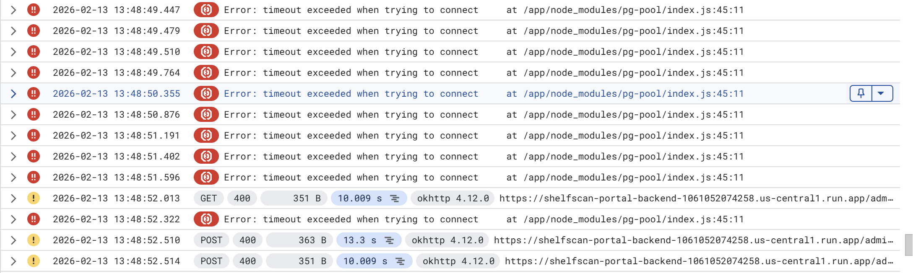

We observed **3,000+ errors within a 1-minute window** during the shutdown/restart cycle.

**After restart:** The database came back online, but recovery was slow. Initial response times were **10–13 seconds** as hundreds of connections attempted to re-establish simultaneously (thundering herd). More critically, **the CPU issue persisted after restart** because the underlying cause — table bloat — was not resolved by a restart.

**~1:10 PM IST — Action 3: Rolling back to Previous Backend Version (DID NOT FIX)**

With the database restarted and still experiencing issues, the team rolled back the backend deployment to the previous known-stable version.

**Result:** No improvement. The same errors continued, confirming the problem was entirely at the database layer.

### Phase 4: Root Cause Identified (~1:15–1:20 PM IST)

With three attempted fixes failing (backend rollback, CPU upgrade, database restart), the team began investigating at the database level directly.

**Step 1 — Checked total active connections:**
```sql
SELECT count(*) FROM pg_stat_activity;
```
Result: Connections were at or near the 600 limit.

**Step 2 — Identified long-running queries:**
```sql
SELECT pid, now() - query_start AS duration, state, query
FROM pg_stat_activity
WHERE state = 'active'
ORDER BY duration DESC;
```

**Critical Finding:** One process associated with the read replica's WAL sender had been running for **over 54 minutes**. This was the red flag.

### Phase 5: Resolution (~1:20 PM IST)

**Action: Stopped the experimental read replica.**

The read replica was immediately stopped. The effect was dramatic:

- Connection count began dropping within minutes
- CPU utilization started declining
- New API requests began succeeding
- Query latencies returned to normal ranges

> **Figure 17 + 18:** Transaction Count (commits dropping during outage, recovering after fix), Connection Count by App Name, New Connections/sec, and Temp Data Size
>
> 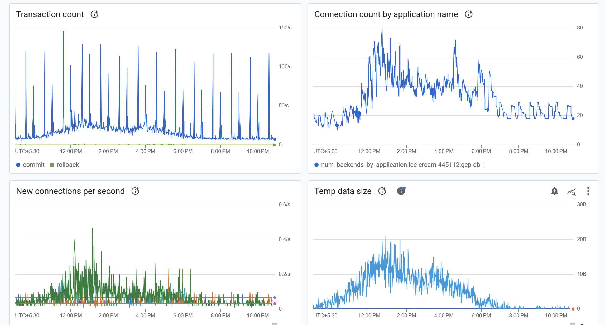

**~2:30 PM IST — Full Recovery:**
All services were fully operational. The surveyor mobile app was functional, portal dashboards were loading, and Metabase analytics were accessible.

---

## 4. Post-Recovery Observations (February 12 evening & February 13)

After the system recovered, the team continued monitoring and reviewing logs. Several additional findings emerged from the February 13 post-recovery investigation period.

### 4.1 Metabase Impact

After the database restarted, Metabase reconnected and began executing heavy analytical queries against the production database. One notable query was a large CTE joining across 6+ tables (`assigned_surveys`, `shops`, `image_collections`, `image_container_product_shares`, `skus`, `shelf_ex_skus`) with aggregation and filtering across 40M+ rows.

These queries were being cancelled by Metabase's own timeout settings:
```
ERROR: canceling statement due to user request
```

Metabase also logged transaction warnings:
```
WARNING: there is no transaction in progress
```

This indicates Metabase was attempting to commit/rollback transactions that had already been terminated, a side effect of the connection disruption.

### 4.2 Staging Database Errors

During the outage window, `shelfscan-staging-v1` also experienced errors:
```
db=shelfscan-staging-v1,user=postgres,host=34.96.46.91 ERROR: insert or update on...
```

> **Figure 19:** Staging database error logs — insert/update failures during the outage window
>
> 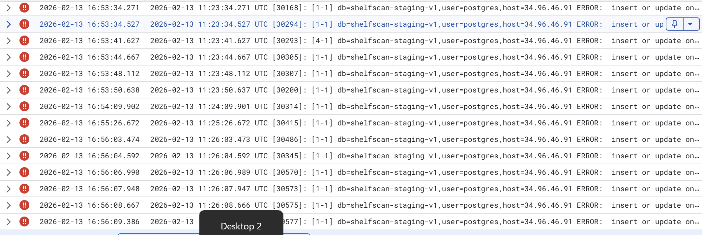

These staging errors confirm that the staging environment shares the same Cloud SQL instance and was impacted by the same resource exhaustion.

### 4.3 Temp File Persistence

Even after the restart on 20 vCPUs and with the replica stopped, the visits SELECT query continued generating excessive temporary files. Logs showed alternating patterns of temp file creation and query execution:

```
LOG: temporary file: path "base/pgsql_tmp/..." 
STATEMENT: select "visits"."id", "visits"."visit_id"...
```

This pattern repeated across thousands of log entries (sequential log numbers climbing past 2,154), indicating the visits query has **inherent performance issues** independent of the replica problem.

> **Figure 20:** Post-recovery logs — alternating temp file and visits SELECT statements, log numbers reaching 2,154+
>
> 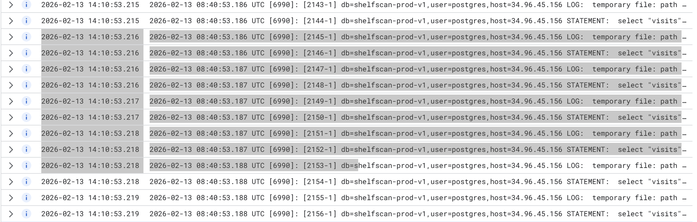

### 4.4 External Unauthorized Access Attempts

Multiple unauthorized connection attempts were detected from external IPs during the post-recovery period:

| IP Address | Attempt Type | Log Entry |
|---|---|---|
| 162.142.125.223 | Protocol scanning | `FATAL: unsupported frontend protocol 0.0` |
| 159.65.217.30 | Protocol scanning | `FATAL: unsupported frontend protocol 0.0` |
| 79.124.40.174 | Brute-force with fake DB name | `db=bbbbbbb... FATAL: expected SASL response` |
| 213.209.159.66 | Password brute-force | `FATAL: password authentication failed for user "postgres"` |

These did not contribute to the outage but indicate that port 5432 on the Cloud SQL instance is accessible from the public internet, representing a security risk.

---

## 5. Root Cause Analysis

This outage was not caused by a single failure. It was a **multi-factor system collapse** where several pre-existing issues combined to create a cascading failure.

### Factor 1: Read Replica Preventing Autovacuum (PRIMARY TRIGGER)

**What happened:**
The read replica created approximately on February 10 maintained a WAL sender process with a long-running transaction on the primary database. This transaction prevented PostgreSQL's autovacuum from cleaning up dead (deleted/updated) rows across all tables.

**How PostgreSQL MVCC works:**
When a row is updated or deleted in PostgreSQL, the old version is not immediately removed. It is marked as "dead" but retained because other active transactions might still need to see the old version (this is called Multi-Version Concurrency Control). The autovacuum process periodically cleans up dead rows — but only rows that no active transaction could possibly need. The replica's long-running transaction effectively told autovacuum: "Don't clean anything — I might still need the old row versions."

**The impact over ~2 days (Feb 10–12):**
Dead rows accumulated across all heavily-written tables (`image_collections`, `image_containers`, `image_container_product_shares`, `visits`, `assigned_surveys`). Every query had to scan through both live AND dead rows. This explains the block read spike to **6 million reads/second** and rows fetched hitting **500 million rows/second** — queries were performing orders of magnitude more I/O than necessary due to scanning bloated tables.

**Evidence:**
- "Oldest Transaction by Age" graph showed a transaction aged ~25,000 seconds (~7 hours)
- Stopping the replica immediately resolved CPU and connection issues
- The replica was the only infrastructure change in the days before the outage
- CPU had been escalating progressively since the replica was created

### Factor 2: Progressive CPU Exhaustion (PRE-EXISTING CONDITION)

**What happened:**
CPU utilization had been climbing over a sustained period due to growing traffic and data volume. The team had already upgraded from 12 → 16 vCPUs in an earlier emergency scaling event. The replica's table bloat accelerated this trend dramatically, pushing the already-strained 16-core system past its limits.

**Why more CPU didn't help:**
The CPU increase from 16 → 20 cores addressed the symptom (not enough compute) but not the disease (queries scanning 10x more data than necessary due to bloat). Even with 20 cores, queries scanning through millions of dead rows consumed the additional capacity immediately.

### Factor 3: Shared Cloud SQL Instance With No Resource Isolation

**What happened:**
A single Cloud SQL instance (`gcp-db-1`) hosts **8+ databases** serving fundamentally different workloads:

| Database | Purpose | Workload Type |
|---|---|---|
| shelfscan-prod-v1 | Production — Shelf scan platform | OLTP (transactional) |
| shelfintel-prod-v1 | Production — Shelf intelligence | OLTP (transactional) |
| shelfpulse-prod-v1 | Production — Shelf pulse | OLTP (transactional) |
| shelfex-dev-v1 | Development — ShelfEx | Development/testing |
| shelfscan-dev-v1 | Development — Shelf scan | Development/testing |
| metabase | Metabase internal DB | Analytics |
| metabase_v58 | Metabase analytics DB | Analytics (heavy reads) |
| cloudsqladmin | Cloud SQL admin | System |

**Why it matters:**
All databases share the same 20 vCPUs, 52 GB RAM, 600-connection limit, and disk I/O bandwidth. There is no isolation between production transactional workloads, development/testing workloads, and heavy analytical workloads. A runaway dev query or a heavy Metabase report directly competes with live production API traffic serving field surveyors.

**The impact:**
- Development databases consumed connections from the same 600-connection pool as production
- Metabase's heavy analytical queries (CTE with 6+ table joins across 40M+ rows) ran against the production primary, competing directly with live surveyor API requests
- During the outage, staging databases also experienced errors, confirming they were affected by and contributing to the shared resource exhaustion

### Factor 4: No Database-Level Guardrails

**What was missing:**

| Configuration | Current State | Recommended | Impact of Absence |
|---|---|---|---|
| `statement_timeout` | Not configured (unlimited) | 30–60s for production | Allowed the replica query to run for 54+ minutes unchecked |
| `idle_in_transaction_session_timeout` | Not configured (unlimited) | 300s (5 minutes) | Allowed a transaction to remain open for ~7 hours, blocking vacuum |
| `work_mem` | Default (~4 MB) | 64–128 MB | Caused 20+ GB of temp file spills across 2,500+ files |
| `log_min_duration_statement` | Not configured | 1000ms | No visibility into slow queries before they became critical |

Without these guardrails, there was no automatic mechanism to kill the problematic transaction, no way to prevent temp file accumulation, and no early warning system for degrading query performance.

### Factor 5: Error Logger Writing to Production Database (AMPLIFICATION)

**What happened:**
The application's error logging system (`dbLogger.js`) writes error records to the production database via the same connection pool. During the outage, every failed API request attempted to log its error to the database — which was the very system that was failing.

**The impact:**
Each failed request generated **two** database connection attempts instead of one: one for the actual query and one for the error log INSERT. This effectively doubled connection pressure during the outage and accelerated pool exhaustion. This is a feedback loop — database errors caused more database load, which caused more errors.

### Factor 6: Connection Pool Thundering Herd (AMPLIFICATION)

**What happened:**
The Node.js `pg-pool` library attempts to create new connections for every incoming request when existing connections are unavailable. When the database was at 600/600 connections or unreachable during the restart, every API request from every Cloud Run instance simultaneously attempted to establish a new connection.

**The impact:**
This generated **3,000+ errors in 1 minute**. After the database restarted, initial recovery was slow (10–13 second response times) because hundreds of clients were simultaneously trying to reconnect, overwhelming the freshly-started database.

### The Complete Cascade

```
Weeks prior: Growing traffic → CPU scaling from 12 → 16 cores (band-aid)
     │
     ▼
~Feb 10: Read replica created (experimental)
     │
     ▼
Feb 10–12: Replica's long transaction blocks autovacuum
           Dead rows accumulate across all tables
           Table bloat grows daily
     │
     ▼
Feb 12 AM: Bloated tables + traffic = CPU at 93% on 16 cores
           Team upgrades to 20 cores (second band-aid)
     │
     ▼
Feb 12 ~1:00 PM: Even 20 cores overwhelmed by bloat + traffic
           Queries slow down → connections held longer
     │
     ▼
           Connection pool fills: 606 / 600 max
     │
     ▼
           New requests get "timeout exceeded when trying to connect"
     │
     ▼
           dbLogger.js tries to log errors to same DB
           → doubles connection pressure (feedback loop)
     │
     ▼
           Complete pool exhaustion → ALL requests fail
     │
     ▼
           DB restart attempted → fast shutdown kills all in-flight queries
           → 3,000+ errors in 1 minute (thundering herd)
     │
     ▼
           DB restarts on 20 cores but BLOAT PERSISTS → CPU still high
     │
     ▼
           Backend rollback attempted → no effect (problem is DB-level)
     │
     ▼
           pg_stat_activity investigation → 54-min replica query found
     │
     ▼
           READ REPLICA STOPPED → vacuum unblocked → system recovers
```

---

## 6. What Fixed It

### The Only Action That Resolved the Outage

**Stopping the experimental read replica.** This:

1. Terminated the long-running WAL sender transaction that had been open for ~7 hours
2. Unblocked autovacuum, allowing it to begin cleaning up dead rows across all tables
3. Released the connections held by the replication process
4. Gradually reduced the volume of data each query needed to scan (as vacuum reclaimed dead rows)
5. CPU utilization dropped → queries completed faster → connections freed up → system recovered

### Actions That Did NOT Fix It

| Action Attempted | Why It Failed |
|---|---|
| Upgrading CPU (12 → 16 → 20 cores) | More CPU doesn't help when queries scan 10x more data than necessary due to bloat |
| Restarting the database | Table bloat persists across restarts — dead rows remain until vacuumed |
| Rolling back backend to previous version | The problem was at the database layer, not in application code |

---

## 7. Impact Assessment

| Metric | Value |
|---|---|
| Total downtime | ~1 hour 30 minutes |
| Users affected | All — surveyors, portal users, analytics users |
| Requests failed | 3,000+ errors in peak 1-minute window; estimated thousands more over full duration |
| Data loss | No data loss confirmed |
| Client escalations | _[To be filled in]_ |
| Revenue impact | _[To be filled in]_ |

---

## 8. Security Observations (Non-Contributing but Concerning)

During post-incident log review on February 13, we identified multiple unauthorized access attempts to the Cloud SQL instance from external IP addresses:

| IP Address | Attempt Type | Risk Level |
|---|---|---|
| 162.142.125.223 | Protocol scanning (unsupported frontend protocol) | Medium |
| 159.65.217.30 | Protocol scanning (unsupported frontend protocol) | Medium |
| 79.124.40.174 | Brute-force with fake DB name "bbbbbbb" | High |
| 213.209.159.66 | Password brute-force for user "postgres" | High |

These indicate that **port 5432 on the Cloud SQL instance is accessible from the public internet**. While these attempts did not succeed (authentication prevented access), they represent a security risk. Automated scanners and attackers are actively probing our database endpoint. A weak or leaked password could result in a data breach.

**Recommendation:** Immediately restrict Cloud SQL authorized networks to allow only known service IPs (Cloud Run, GCE instances, Metabase server).

---

## 9. Action Items

### Immediate Priority (This Week)

| # | Action | Owner | Deadline | Status | Ticket |
|---|---|---|---|---|---|
| 1 | Configure `idle_in_transaction_session_timeout = 300s` | _[Name]_ | _[Date]_ | ⬜ Pending | _[Link]_ |
| 2 | Configure `statement_timeout = 60s` | _[Name]_ | _[Date]_ | ⬜ Pending | _[Link]_ |
| 3 | Increase `work_mem` from ~4 MB to 64 MB | _[Name]_ | _[Date]_ | ⬜ Pending | _[Link]_ |
| 4 | Add circuit breaker to `dbLogger.js` (fallback to stdout) | _[Name]_ | _[Date]_ | ⬜ Pending | _[Link]_ |
| 5 | Restrict Cloud SQL authorized networks (remove public access) | _[Name]_ | _[Date]_ | ⬜ Pending | _[Link]_ |

### Short-Term Priority (This Month)

| # | Action | Owner | Deadline | Status | Ticket |
|---|---|---|---|---|---|
| 6 | Separate dev databases to dedicated Cloud SQL instance | _[Name]_ | _[Date]_ | ⬜ Pending | _[Link]_ |
| 7 | Move Metabase to dedicated read replica (properly configured) | _[Name]_ | _[Date]_ | ⬜ Pending | _[Link]_ |
| 8 | Set up monitoring alerts (CPU, connections, transaction age, temp files) | _[Name]_ | _[Date]_ | ⬜ Pending | _[Link]_ |
| 9 | Run VACUUM on major tables (image_collections, visits, assigned_surveys, etc.) | _[Name]_ | _[Date]_ | ⬜ Pending | _[Link]_ |

### Long-Term Priority (This Quarter)

| # | Action | Owner | Deadline | Status | Ticket |
|---|---|---|---|---|---|
| 10 | Implement PgBouncer as external connection pooler | _[Name]_ | _[Date]_ | ⬜ Pending | _[Link]_ |
| 11 | Migrate error logging to Cloud Logging + BigQuery pipeline | _[Name]_ | _[Date]_ | ⬜ Pending | _[Link]_ |
| 12 | Optimize visits query (EXPLAIN ANALYZE, add indexes) | _[Name]_ | _[Date]_ | ⬜ Pending | _[Link]_ |
| 13 | Establish database change management process | _[Name]_ | _[Date]_ | ⬜ Pending | _[Link]_ |

_Status key: ⬜ Pending | 🔄 In Progress | ✅ Complete | ❌ Won't Do (explain why)_

### Alert Thresholds to Configure (Action Item #8 Detail)

| Metric | Warning | Critical |
|---|---|---|
| CPU utilization (P99) | > 80% | > 90% |
| Peak connections | > 500 | > 580 |
| Oldest transaction age | > 120 seconds | > 300 seconds |
| Replication lag (if replica exists) | > 30 seconds | > 60 seconds |
| Temp file size | > 1 GB | > 5 GB |
| Query latency (P99) | > 5 seconds | > 15 seconds |

### Read Replica Configuration (Action Item #7 Detail)

When setting up the Metabase read replica, configure:
- `hot_standby_feedback = off` (prevent replica from blocking vacuum on primary)
- `max_standby_streaming_delay = 30s` (limit how long replica queries can delay WAL replay)
- `wal_sender_timeout = 60s` on primary (kill stuck WAL senders)

---

## 10. Lessons Learned

**1. Treating symptoms delays finding the cure.**
The team's instinct to add more CPU was reasonable but addressed the symptom (high CPU) rather than the cause (table bloat from the replica). Each CPU upgrade bought temporary relief and delayed investigation of the root cause. When vertical scaling stops working, the problem is almost always in the data layer — bloat, bad queries, or missing indexes.

**2. Infrastructure changes need monitoring buffers.**
The read replica was created ~2 days before the outage without corresponding monitoring alerts for transaction age, replication lag, or CPU trends. The system was visibly degrading on Feb 12 morning (93% CPU), but without alerts, this wasn't caught until it became a full outage.

**3. Rollback is not always the fix.**
The instinct to rollback the backend was the correct first response, but when it didn't help, it provided a critical diagnostic signal: the problem was below the application layer. Future runbooks should include database-level checks (`pg_stat_activity`, connection counts, oldest transaction age) as an early step, not a last resort.

**4. Shared infrastructure is a liability.**
Having production, development, analytics, and experimental workloads on a single database instance means any one of them can impact all the others. The read replica was "just an experiment" — but it took down all production services for 90 minutes. Resource isolation is not a luxury; it is a production safety requirement.

**5. Guardrails must exist before they're needed.**
`statement_timeout` and `idle_in_transaction_session_timeout` are zero-cost configurations that would have automatically killed the problematic transaction within minutes. The absence of these guardrails allowed a manageable issue (a slow replica query) to escalate into a complete system failure.

**6. Error handling should never depend on the thing that's failing.**
Writing error logs to the same database experiencing an outage amplifies the problem instead of recording it. Logging infrastructure must be independent of the systems it monitors.

---

## 11. Evidence

| Figure | Description | File |
|---|---|---|
| Fig 1 | Cloud SQL Dashboard — Feb 12 morning (93.867% CPU, 108 connections) | [evidence/fig01-cloud-sql-dashboard-morning.png](evidence/fig01-cloud-sql-dashboard-morning.png) |
| Fig 2, 3, 11 | Query Latency (P99 30-40s), CPU Utilization, Database Load by DB, Log Entries by Severity | [evidence/fig02-03-11-query-latency-cpu-dbload.png](evidence/fig02-03-11-query-latency-cpu-dbload.png) |
| Fig 4, 6 | Oldest Transaction by Age (~25,000s), Rows Fetched vs Returned vs Written (500M/s), WAL Archiving, Transaction ID utilization | [evidence/fig04-06-oldest-txn-rows-fetched.png](evidence/fig04-06-oldest-txn-rows-fetched.png) |
| Fig 5, 10 | Block Read Count (spike to 6M/s), Deadlock Count (zero), Rows Processed, Rows in DB by state | [evidence/fig05-10-block-reads-deadlock-rows.png](evidence/fig05-10-block-reads-deadlock-rows.png) |
| Fig 7 | GCP Log Summary (522 entries in 30 seconds) | [evidence/fig07-gcp-log-summary.png](evidence/fig07-gcp-log-summary.png) |
| Fig 8 | Backend HTTP 400 errors (rapid-fire GET 400s from okhttp) | [evidence/fig08-backend-400-errors.png](evidence/fig08-backend-400-errors.png) |
| Fig 9 | Cloud SQL Dashboard gauges (CPU 89.483%, connections 606, 486 errors) | [evidence/fig09-cloud-sql-dashboard-outage.png](evidence/fig09-cloud-sql-dashboard-outage.png) |
| Fig 10 | Deadlock Count by Database (flat zero, standalone view) | [evidence/fig10-deadlock-count.png](evidence/fig10-deadlock-count.png) |
| Fig 12, 13 | Connections per Database (8+ DBs), Wait Event Types (spike to 30+), IO Wait Breakdown, Data Transfer bytes | [evidence/fig12-13-connections-wait-events.png](evidence/fig12-13-connections-wait-events.png) |
| Fig 14, 17, 18 | Temp Data Size, Transaction Count (commit/rollback), Connection Count by App Name, New Connections/sec | [evidence/fig14-17-18-txn-connections-temp.png](evidence/fig14-17-18-txn-connections-temp.png) |
| Fig 14, 15 | Temp Data Size with DB legend (20+ GB), Temp Files count (peak ~2,500–3,000), New Connections/sec with legend | [evidence/fig14-15-temp-data-and-files.png](evidence/fig14-15-temp-data-and-files.png) |
| Fig 16 | Backend pg-pool timeout errors + slow recovery (10-13s response times) | [evidence/fig16-backend-timeout-errors.png](evidence/fig16-backend-timeout-errors.png) |
| Fig 19 | Staging database insert/update errors during outage window | [evidence/fig19-staging-errors.png](evidence/fig19-staging-errors.png) |
| Fig 20 | Post-recovery logs — alternating temp file + visits SELECT statements | [evidence/fig20-post-recovery-temp-files.png](evidence/fig20-post-recovery-temp-files.png) |

---

## Postmortem Meeting

| Field | Detail |
|---|---|
| **Date** | _[To be scheduled]_ |
| **Attendees** | _[To be filled in]_ |
| **Notes** | See `postmortem-notes.md` |

---

*Report Date: February 15, 2026*
*Incident Date: February 12, 2026*
*Status: Post-incident review complete. Awaiting implementation of recommended actions.*
*Next Review: After completion of Immediate Priority items*